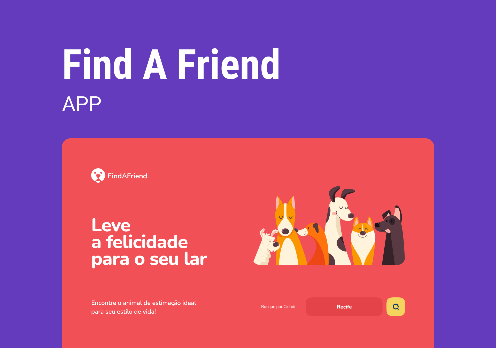

# GCC - Find a Frind

## Sobre o Green Chain Challenge

O Green Chain Challenge é um projeto desenvolvido especialmente para a comunidade com desafios que simulam situações reais que, você dev, vai encontrar no mercado de trabalho! 

Mais informações aqui: [sobre o gcc](_docs/about-gcc.md)

## Sobre o desafio 

Foi desenvolvido a tela inicial da aplicação, assim como a página para procurar por pets, efetuando todas as operações solicitadas para que os filtros ocorram.

## Tecnologias utilizadas

- React.js
- Styled Components
- Axios

